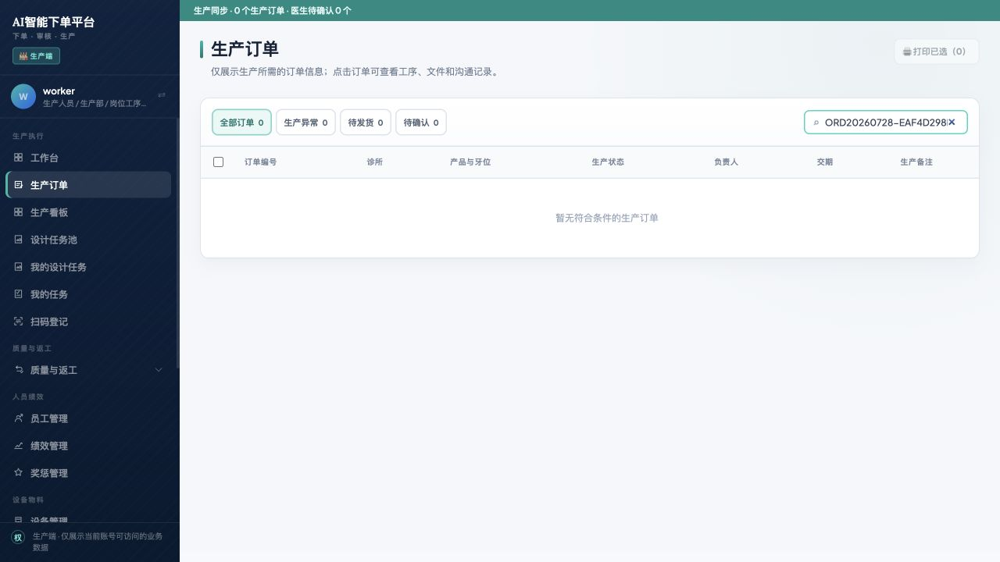
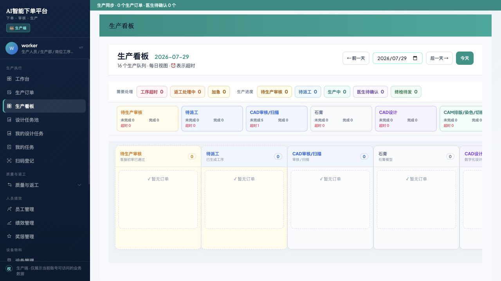
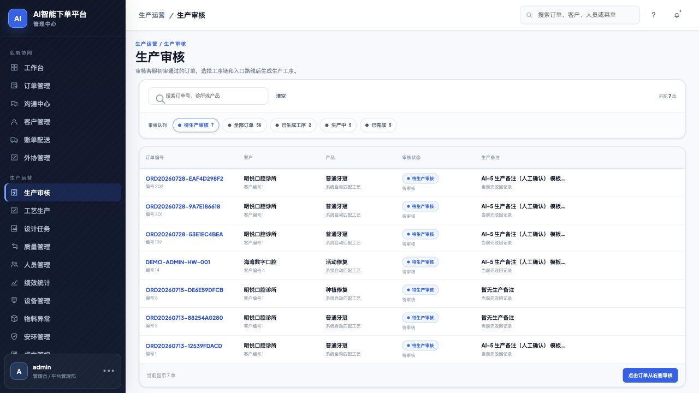

# 演示前端生产审核隔离复验证明

> **历史证据说明（2026-07-31）**：本文记录的是 Flyway V55 与当时“仅 ADMIN
> 生产审核”口径下的原始复验，内容保留用于追溯，不代表当前产品规则。该口径已被
> `DECISIONS.md` 的 D-173 及增量迁移 V56 取代：当前由具有
> `workflow:review-production` 直接权限的生产审核人员主责，ADMIN 只做同队列监控和
> 有理由的异常兜底，普通 WORKER/CS 禁止。

## 1. 复验对象

- 复验日期：2026-07-29
- 目标订单：`ORD20260728-EAF4D298F2`
- 实际入口：`http://127.0.0.1:15173`
- 前端类型：**演示前端**
- 对应后端：`http://127.0.0.1:18080`
- 对应数据库：`ai_order_platform_demo`

`http://localhost:5173` 是标准本地前端，连接标准本地数据库。目标订单只存在于演示数据库，因此本次结论以 `15173` 演示前端为准。

## 2. 问题原因

此前修复已经写入当前项目工作树，但 `15173/18080` 演示环境仍由修复前启动的旧后端进程提供服务，未加载 Flyway V55，所以生产账号仍能读取待生产审核订单。

本次已停止旧演示后端进程并从当前项目重新启动演示前后端。没有重置、删除或改写既有演示数据，标准本地环境也未被停止。

## 3. 当前运行状态

| 项目 | 状态 |
|---|---|
| 演示前端 | `15173`，运行中且已就绪 |
| 演示后端 | `18080`，运行中且健康检查通过 |
| 数据库迁移 | Flyway `V55 admin only production review`，`success=1` |
| 生产审核权限 | 仅 `ADMIN` 保留 `workflow:review-production` |
| 目标订单状态 | `PENDING_PRODUCTION_REVIEW / PENDING_REVIEW` |
| 生产审核时间 | `NULL`，本次没有点击审核或改变订单状态 |

## 4. 真实浏览器结果

| 角色与页面 | 实际结果 | 结论 |
|---|---|---|
| 生产端 / 生产订单 | 精确搜索目标订单，结果为 0，页面显示“暂无符合条件的生产订单” | PASS |
| 生产端 / 生产看板 | “待生产审核”为 0，目标订单未出现 | PASS |
| 管理端 / 生产审核 | 目标订单仍在待生产审核队列，状态为“待生产审核 / 待审核” | PASS |
| 生产端菜单 | 不再显示“生产审核”菜单 | PASS |

这证明客服初审后、管理员生产审核前，订单只应进入管理端审核队列，不应进入生产人员可见的订单池或生产看板。

## 5. 截图证据

### 5.1 生产端精确搜索为 0

### 5.2 生产看板待生产审核为 0

### 5.3 管理端仍可见待审核订单

## 6. 最终结论

针对订单 `ORD20260728-EAF4D298F2`，演示前端 `15173` 已加载当前项目中的修复：

- 客服初审后，生产端搜不到、看板中也不出现该订单。
- 管理端生产审核页面仍能看到该订单并等待管理员处理。
- 本轮仅做只读复验，没有通过审核，也没有推进订单状态。
